# 女装-裤子-弯刀蕾丝阔腿裤 作图方案

- 来源文件：`source.pptx`
- 共 13 页
- 阅读方法：每页先看「整页截图」了解排版和标注，再看「文字」和「页内图片」。页内图片是 PPT 里放的原图（多为竞品参考图），位置描述指它在这一页的哪个区域。

---

## 第 1 页

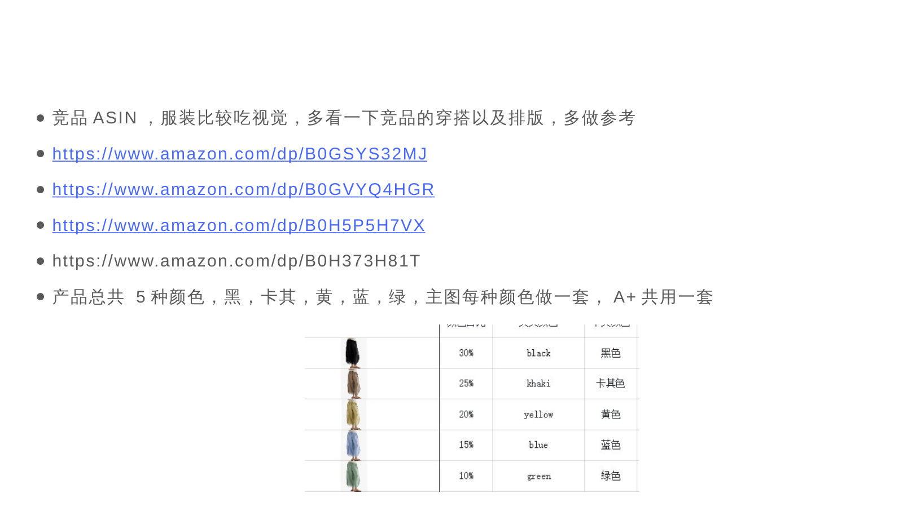

### 文字

竞品ASIN，服装比较吃视觉，多看一下竞品的穿搭以及排版，多做参考
https://www.amazon.com/dp/B0GSYS32MJ
https://www.amazon.com/dp/B0GVYQ4HGR
https://www.amazon.com/dp/B0H5P5H7VX
https://www.amazon.com/dp/B0H373H81T
产品总共 5种颜色，黑，卡其，黄，蓝，绿，主图每种颜色做一套，A+共用一套

### 页内图片

| 图片 | 在页面的位置 | 占页面大小 | 原图尺寸 |
| --- | --- | --- | --- |
| 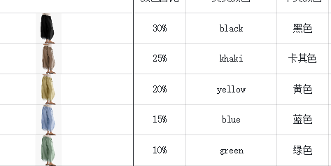 | 中间下部 | 宽 37% × 高 33% | 473×237 |

---

## 第 2 页

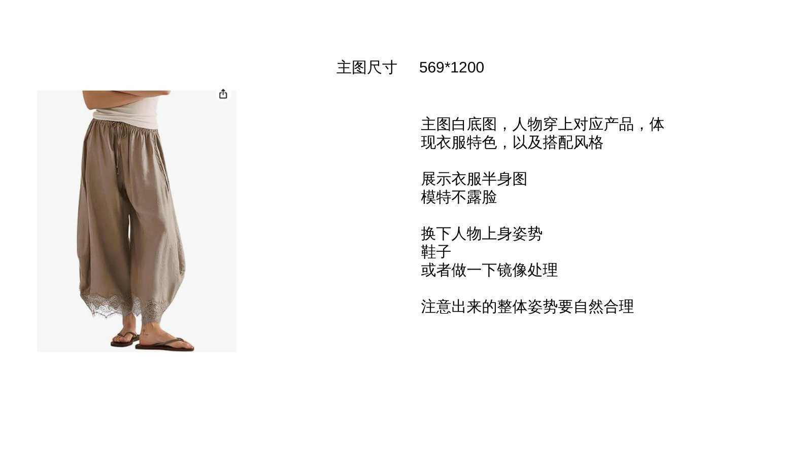

### 文字

主图尺寸    569*1200

主图白底图，人物穿上对应产品，体现衣服特色，以及搭配风格

展示衣服半身图
模特不露脸

换下人物上身姿势
鞋子
或者做一下镜像处理

注意出来的整体姿势要自然合理

### 页内图片

| 图片 | 在页面的位置 | 占页面大小 | 原图尺寸 |
| --- | --- | --- | --- |
| 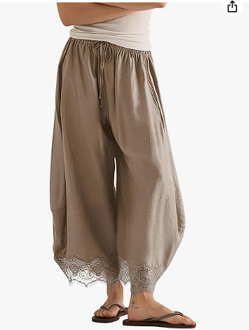 | 左侧中部 | 宽 25% × 高 58% | 314×416 |

---

## 第 3 页

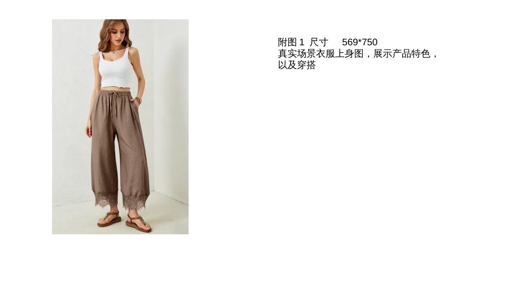

### 文字

附图1 尺寸    569*750
真实场景衣服上身图，展示产品特色，以及穿搭

### 页内图片

| 图片 | 在页面的位置 | 占页面大小 | 原图尺寸 |
| --- | --- | --- | --- |
| 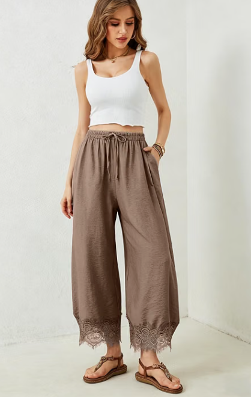 | 左侧中部 | 宽 27% × 高 75% | 418×660 |

---

## 第 4 页

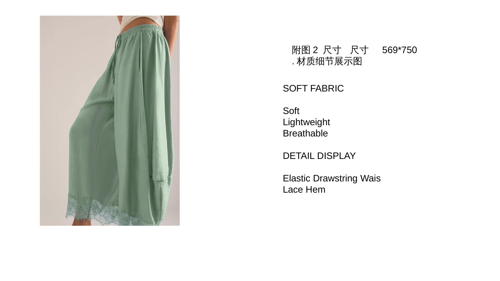

### 文字

附图2 尺寸   尺寸    569*750
.材质细节展示图

SOFT FABRIC

Soft
Lightweight
Breathable

DETAIL DISPLAY

Elastic Drawstring Wais
Lace Hem

### 页内图片

| 图片 | 在页面的位置 | 占页面大小 | 原图尺寸 |
| --- | --- | --- | --- |
| 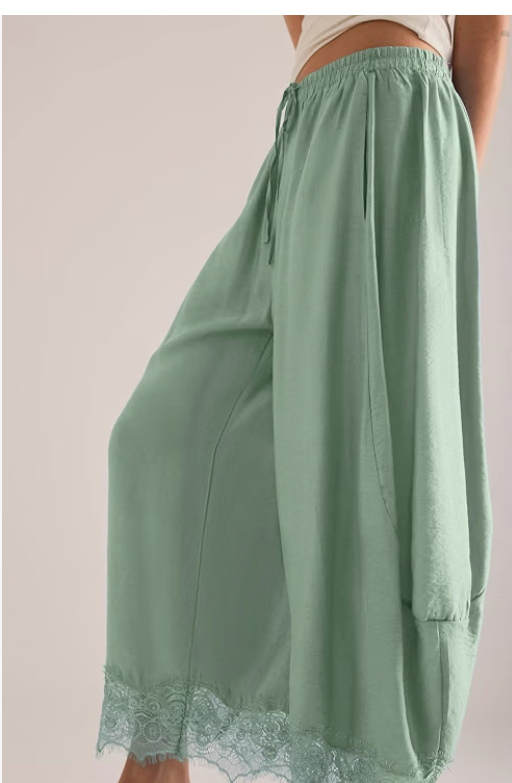 | 左侧中部 | 宽 28% × 高 76% | 512×783 |

---

## 第 5 页

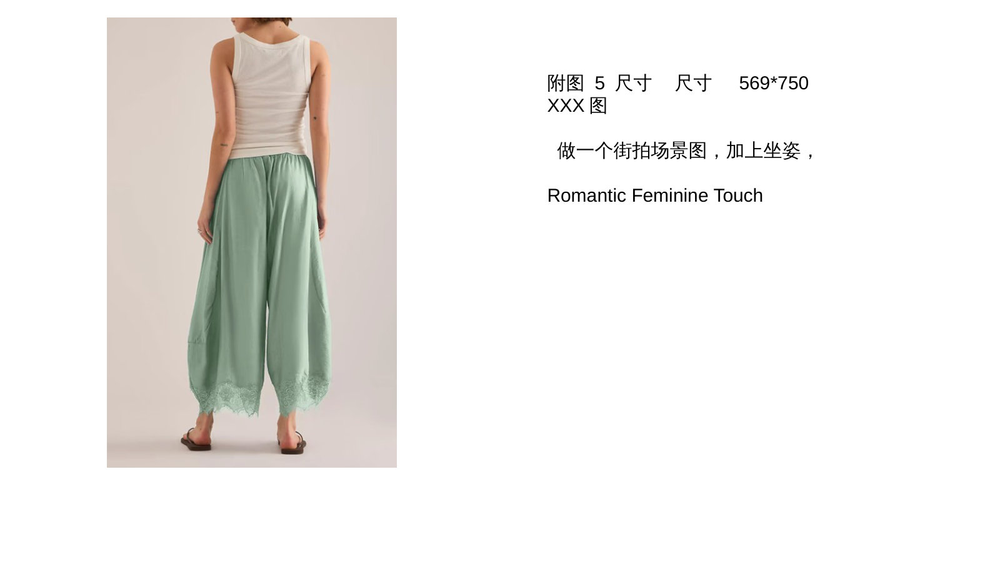

### 文字

附图 5 尺寸    尺寸    569*750
XXX图

 做一个街拍场景图，加上坐姿，

Romantic Feminine Touch

### 页内图片

| 图片 | 在页面的位置 | 占页面大小 | 原图尺寸 |
| --- | --- | --- | --- |
| 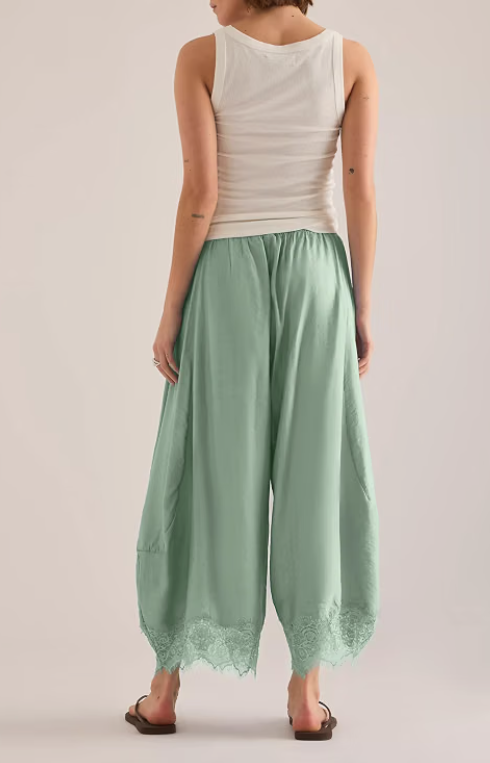 | 左侧中部 | 宽 29% × 高 80% | 490×763 |

---

## 第 6 页

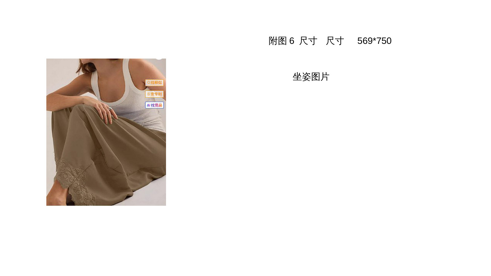

### 文字

附图6 尺寸   尺寸    569*750

坐姿图片

### 页内图片

| 图片 | 在页面的位置 | 占页面大小 | 原图尺寸 |
| --- | --- | --- | --- |
| 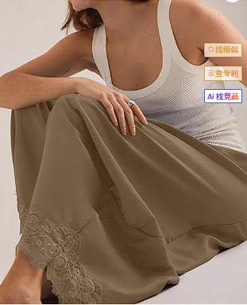 | 左侧中部 | 宽 24% × 高 53% | 311×384 |

---

## 第 7 页

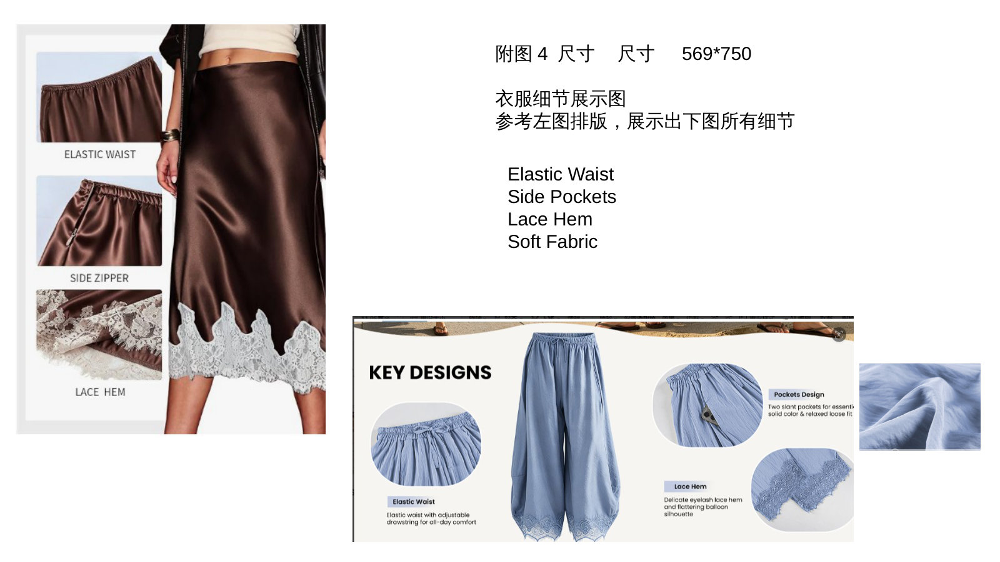

### 文字

附图4 尺寸    尺寸    569*750

衣服细节展示图
参考左图排版，展示出下图所有细节

Elastic Waist
Side Pockets
Lace Hem
Soft Fabric

### 页内图片

| 图片 | 在页面的位置 | 占页面大小 | 原图尺寸 |
| --- | --- | --- | --- |
| 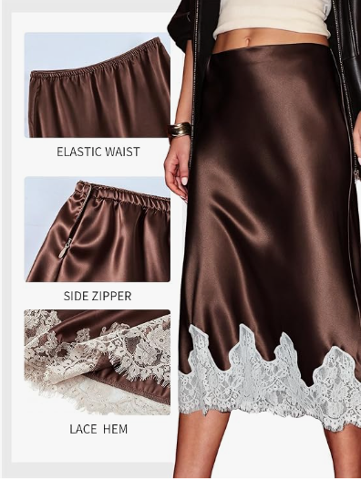 | 左侧中部 | 宽 31% × 高 73% | 396×527 |
| 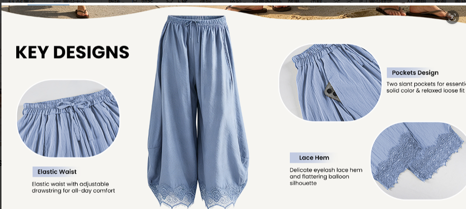 | 中间下部 | 宽 50% × 高 40% | 947×426 |
| 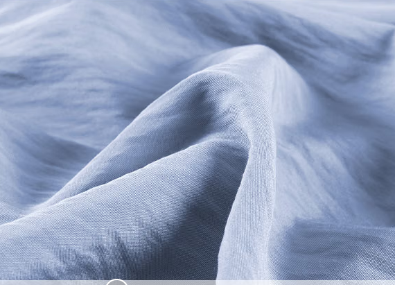 | 右侧下部 | 宽 12% × 高 15% | 570×411 |

---

## 第 8 页

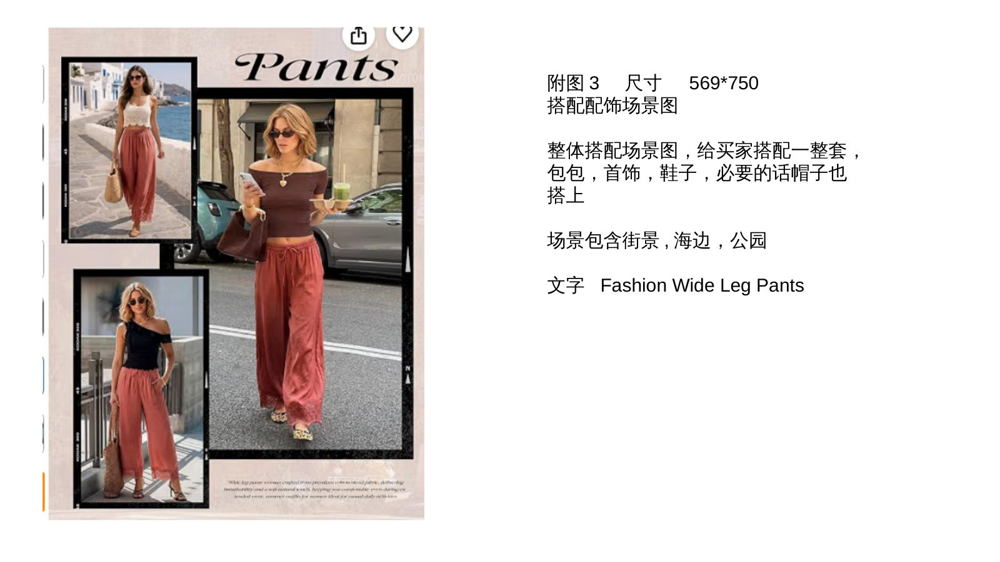

### 文字

附图3    尺寸    569*750
搭配配饰场景图

整体搭配场景图，给买家搭配一整套，包包，首饰，鞋子，必要的话帽子也搭上

场景包含街景,海边，公园

文字  Fashion Wide Leg Pants

### 页内图片

| 图片 | 在页面的位置 | 占页面大小 | 原图尺寸 |
| --- | --- | --- | --- |
| 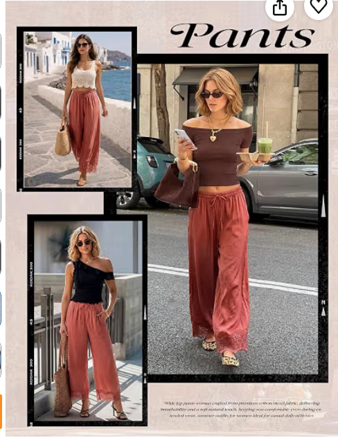 | 左侧中部 | 宽 38% × 高 88% | 488×636 |

---

## 第 9 页

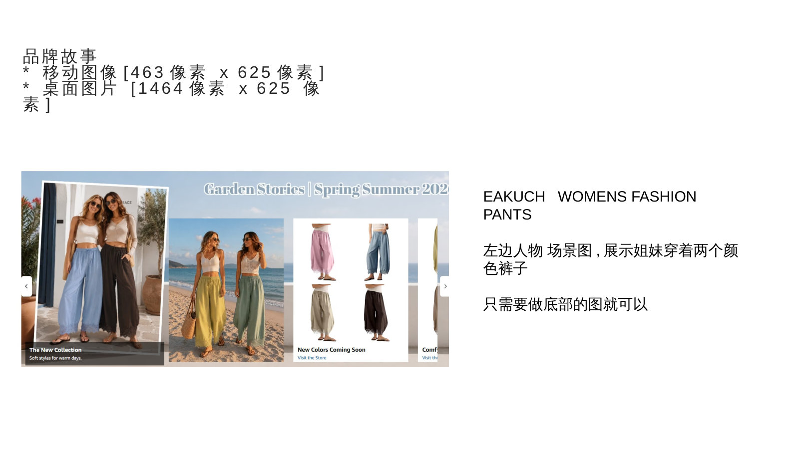

### 文字

**品牌故事* 移动图像[463像素 x 625像素]* 桌面图片 [1464像素 x 625 像素]**

EAKUCH   WOMENS FASHION PANTS

左边人物 场景图,展示姐妹穿着两个颜色裤子

只需要做底部的图就可以

### 页内图片

| 图片 | 在页面的位置 | 占页面大小 | 原图尺寸 |
| --- | --- | --- | --- |
| 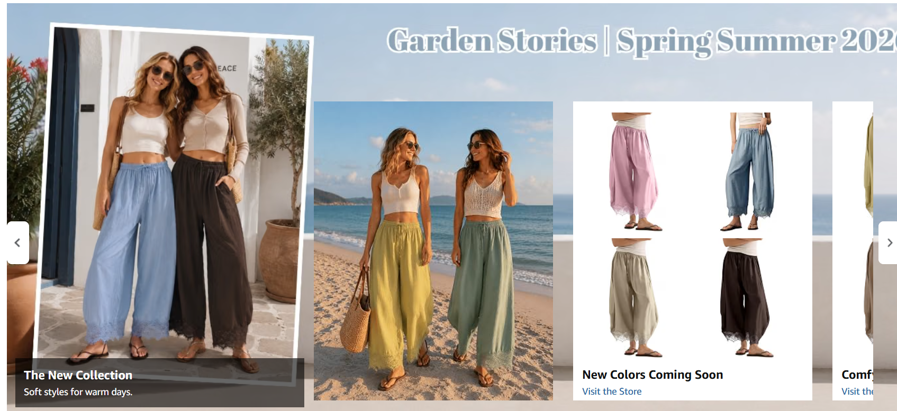 | 左侧中部 | 宽 54% × 高 44% | 1695×778 |

---

## 第 10 页

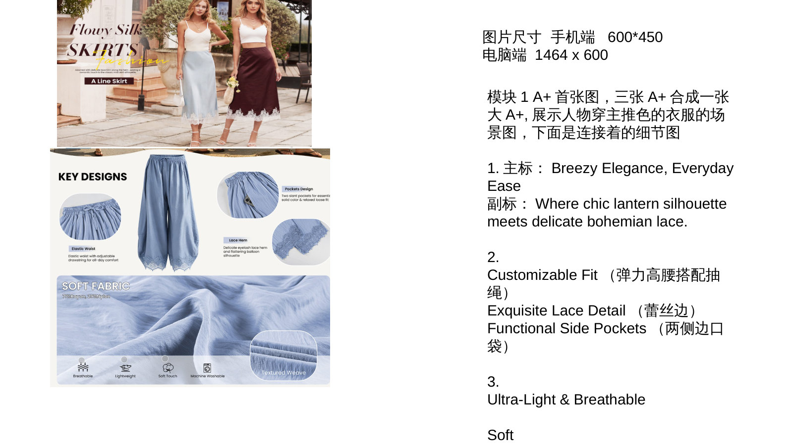

### 文字

图片尺寸  手机端  600*450
电脑端 1464 x 600

模块1 A+首张图，三张A+合成一张大A+,展示人物穿主推色的衣服的场景图，下面是连接着的细节图

1.主标：Breezy Elegance, Everyday Ease
副标：Where chic lantern silhouette meets delicate bohemian lace.

2.
Customizable Fit（弹力高腰搭配抽绳）
Exquisite Lace Detail（蕾丝边）
Functional Side Pockets（两侧边口袋）

3.
Ultra-Light & Breathable

Soft
Lightweight
Breathable

### 页内图片

| 图片 | 在页面的位置 | 占页面大小 | 原图尺寸 |
| --- | --- | --- | --- |
| 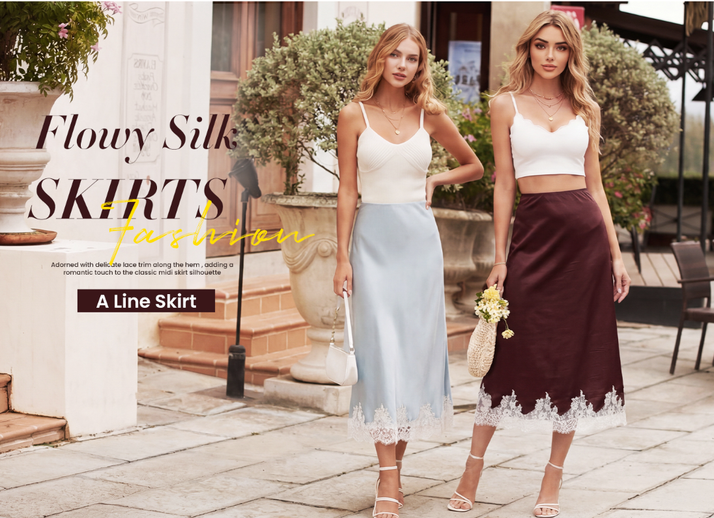 | 左侧上部 | 宽 32% × 高 35% | 1096×796 |
| 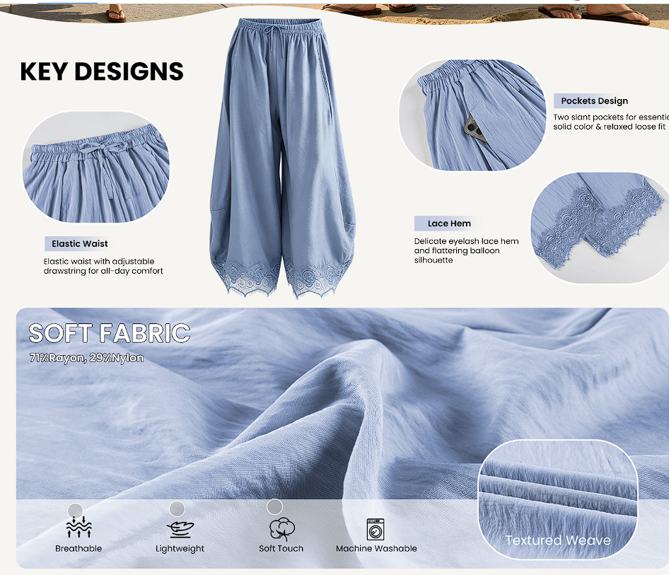 | 左侧中部 | 宽 35% × 高 54% | 946×813 |

---

## 第 11 页

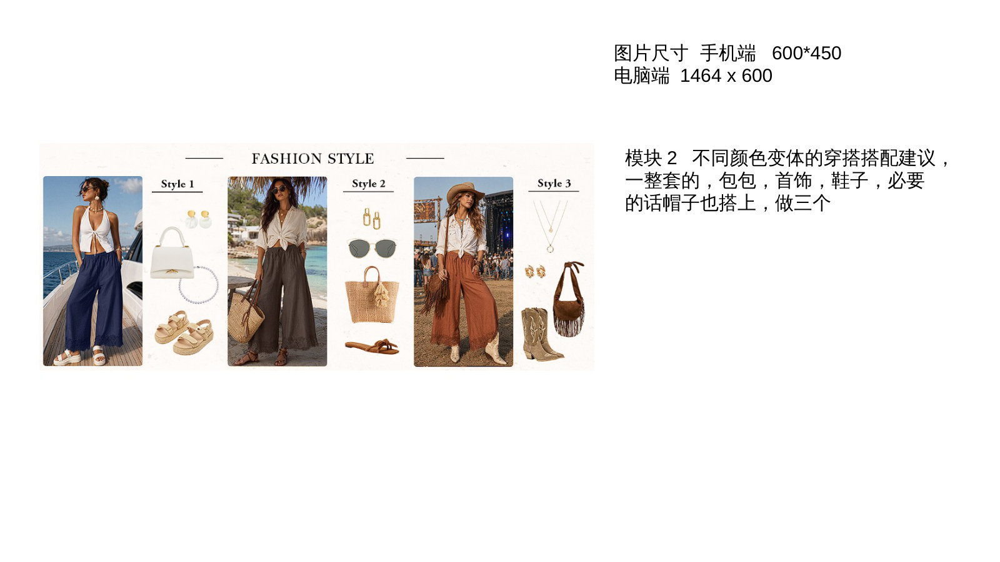

### 文字

图片尺寸  手机端  600*450
电脑端 1464 x 600

模块2  不同颜色变体的穿搭搭配建议，一整套的，包包，首饰，鞋子，必要的话帽子也搭上，做三个

### 页内图片

| 图片 | 在页面的位置 | 占页面大小 | 原图尺寸 |
| --- | --- | --- | --- |
| 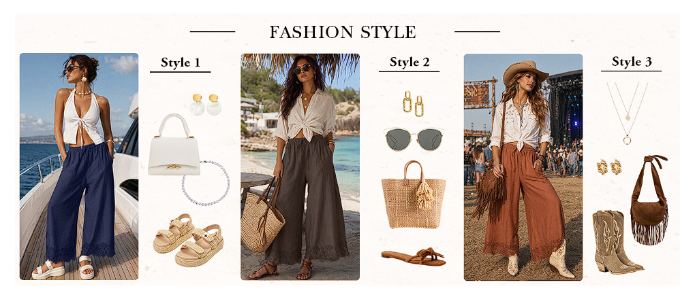 | 左侧中部 | 宽 58% × 高 44% | 1020×437 |

---

## 第 12 页

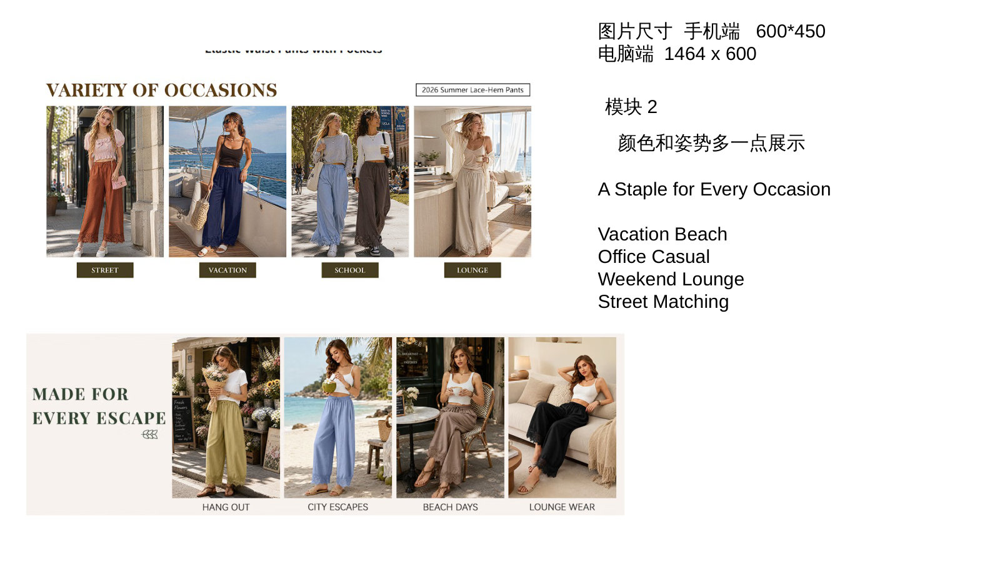

### 文字

图片尺寸  手机端  600*450
电脑端 1464 x 600

模块2

颜色和姿势多一点展示

A Staple for Every Occasion

Vacation Beach
Office Casual
Weekend Lounge
Street Matching

### 页内图片

| 图片 | 在页面的位置 | 占页面大小 | 原图尺寸 |
| --- | --- | --- | --- |
| 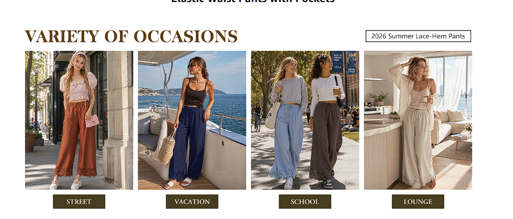 | 左侧上部 | 宽 56% × 高 42% | 1005×431 |
| 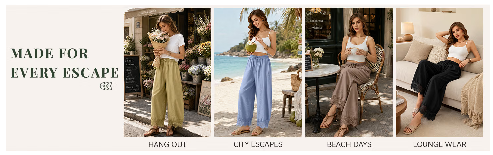 | 左侧下部 | 宽 61% × 高 34% | 1490×471 |

---

## 第 13 页

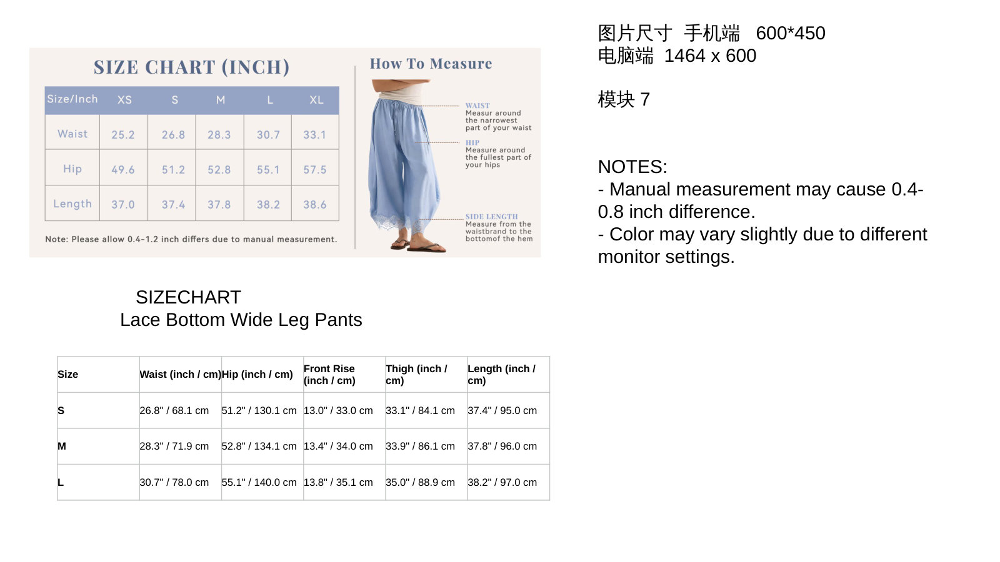

### 文字

图片尺寸  手机端  600*450
电脑端 1464 x 600

模块7

NOTES:
- Manual measurement may cause 0.4-0.8 inch difference.
- Color may vary slightly due to different monitor settings.

SIZECHART
Lace Bottom Wide Leg Pants

### 表格

| Size | Waist (inch / cm) | Hip (inch / cm) | Front Rise (inch / cm) | Thigh (inch / cm) | Length (inch / cm) |
| --- | --- | --- | --- | --- | --- |
| S | 26.8" / 68.1 cm | 51.2" / 130.1 cm | 13.0" / 33.0 cm | 33.1" / 84.1 cm | 37.4" / 95.0 cm |
| M | 28.3" / 71.9 cm | 52.8" / 134.1 cm | 13.4" / 34.0 cm | 33.9" / 86.1 cm | 37.8" / 96.0 cm |
| L | 30.7" / 78.0 cm | 55.1" / 140.0 cm | 13.8" / 35.1 cm | 35.0" / 88.9 cm | 38.2" / 97.0 cm |

### 页内图片

| 图片 | 在页面的位置 | 占页面大小 | 原图尺寸 |
| --- | --- | --- | --- |
| 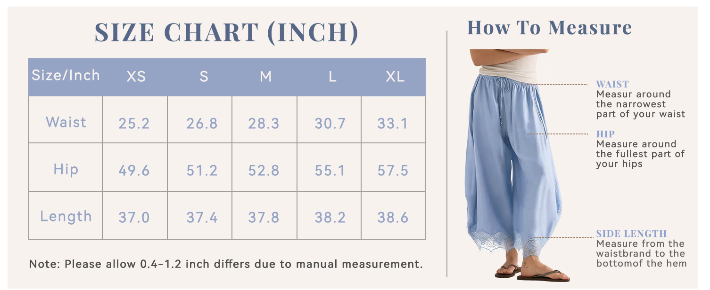 | 左侧上部 | 宽 53% × 高 38% | 1506×617 |
