# 女装-卫衣-半高领宽松卫衣 作图方案

- 来源文件：`source.pptx`
- 共 14 页
- 阅读方法：每页先看「整页截图」了解排版和标注，再看「文字」和「页内图片」。页内图片是 PPT 里放的原图（多为竞品参考图），位置描述指它在这一页的哪个区域。

---

## 第 1 页

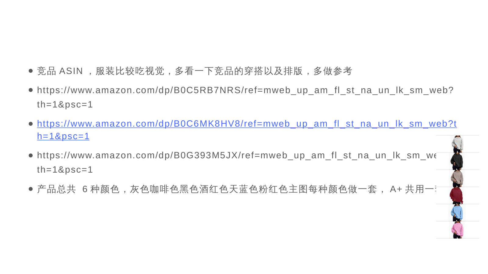

### 文字

竞品ASIN，服装比较吃视觉，多看一下竞品的穿搭以及排版，多做参考
https://www.amazon.com/dp/B0C5RB7NRS/ref=mweb_up_am_fl_st_na_un_lk_sm_web?th=1&psc=1
https://www.amazon.com/dp/B0C6MK8HV8/ref=mweb_up_am_fl_st_na_un_lk_sm_web?th=1&psc=1
https://www.amazon.com/dp/B0G393M5JX/ref=mweb_up_am_fl_st_na_un_lk_sm_web?th=1&psc=1
产品总共 6种颜色，灰色咖啡色黑色酒红色天蓝色粉红色主图每种颜色做一套，A+共用一套

### 页内图片

| 图片 | 在页面的位置 | 占页面大小 | 原图尺寸 |
| --- | --- | --- | --- |
| 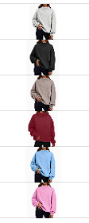 | 右侧下部 | 宽 9% × 高 39% | 112×281 |

---

## 第 2 页

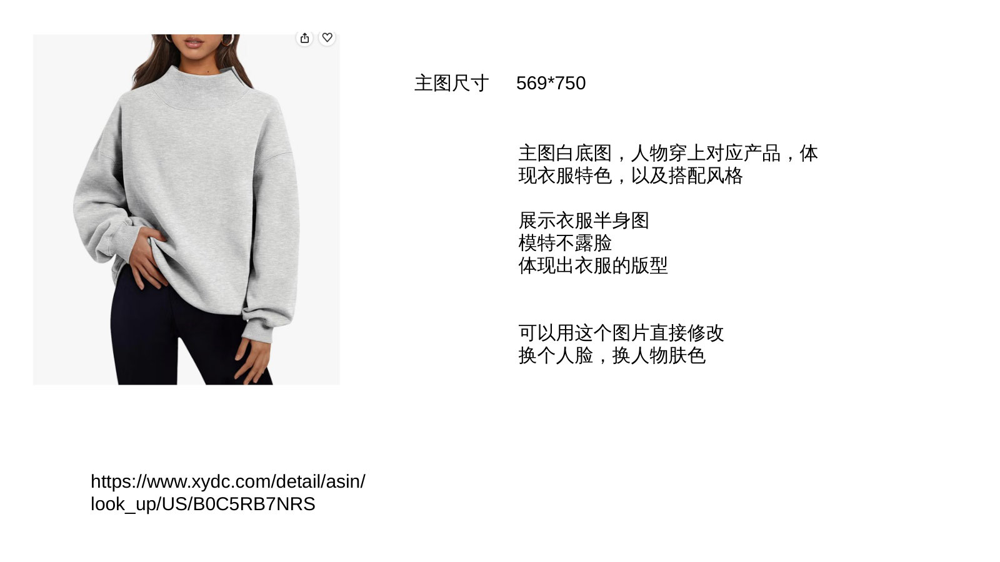

### 文字

主图尺寸    569*750

主图白底图，人物穿上对应产品，体现衣服特色，以及搭配风格

展示衣服半身图
模特不露脸
体现出衣服的版型

可以用这个图片直接修改
换个人脸，换人物肤色

https://www.xydc.com/detail/asin/look_up/US/B0C5RB7NRS

### 页内图片

| 图片 | 在页面的位置 | 占页面大小 | 原图尺寸 |
| --- | --- | --- | --- |
| 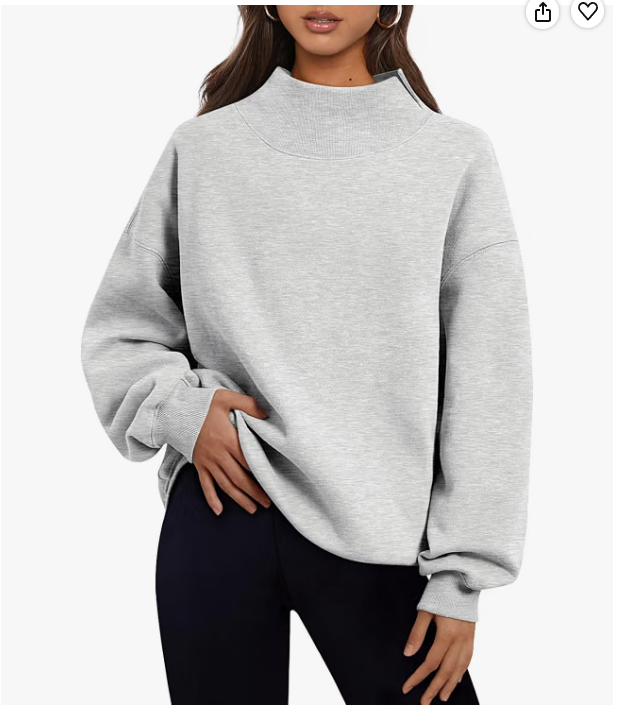 | 左侧中部 | 宽 31% × 高 63% | 627×707 |

---

## 第 3 页

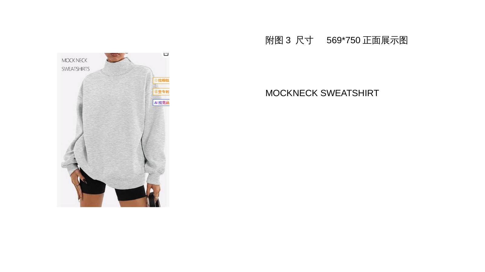

### 文字

附图3 尺寸    569*750正面展示图

MOCKNECK SWEATSHIRT

### 页内图片

| 图片 | 在页面的位置 | 占页面大小 | 原图尺寸 |
| --- | --- | --- | --- |
| 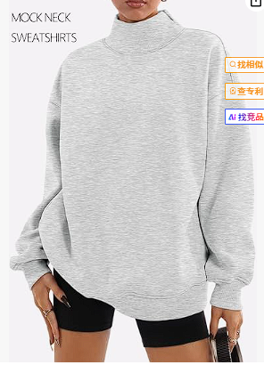 | 左侧中部 | 宽 23% × 高 57% | 296×410 |

---

## 第 4 页

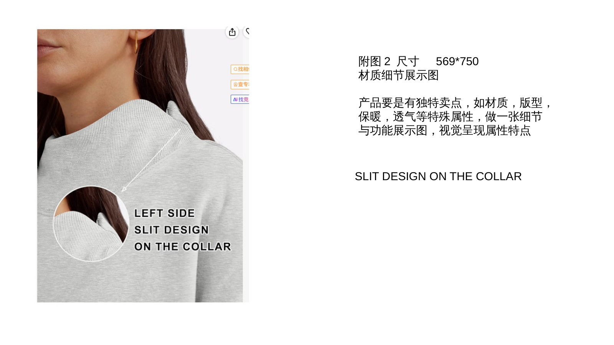

### 文字

附图2 尺寸    569*750
材质细节展示图

产品要是有独特卖点，如材质，版型，保暖，透气等特殊属性，做一张细节与功能展示图，视觉呈现属性特点

SLIT DESIGN ON THE COLLAR

### 页内图片

| 图片 | 在页面的位置 | 占页面大小 | 原图尺寸 |
| --- | --- | --- | --- |
| 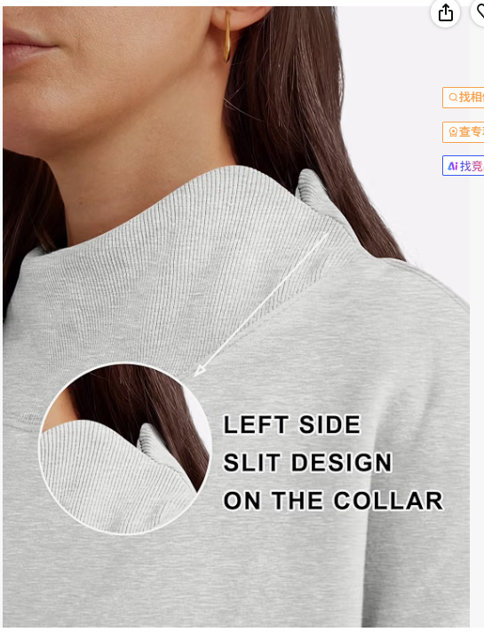 | 左侧中部 | 宽 35% × 高 82% | 545×721 |

---

## 第 5 页

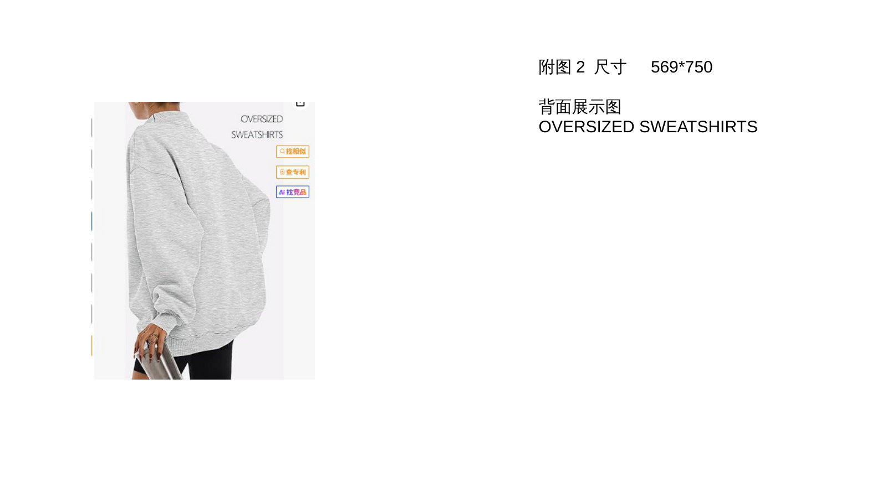

### 文字

附图2 尺寸    569*750

背面展示图
OVERSIZED SWEATSHIRTS

### 页内图片

| 图片 | 在页面的位置 | 占页面大小 | 原图尺寸 |
| --- | --- | --- | --- |
| 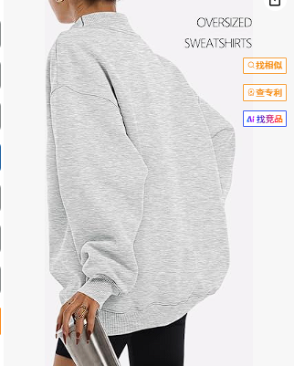 | 左侧中部 | 宽 25% × 高 56% | 322×401 |

---

## 第 6 页

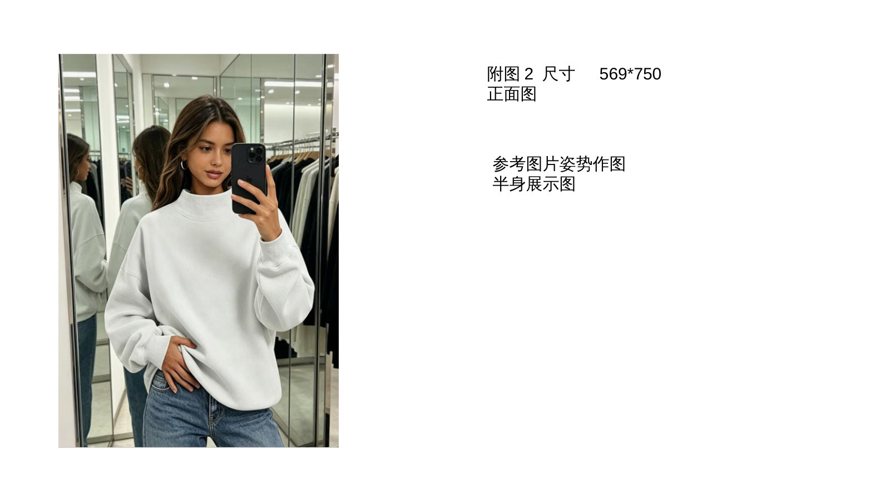

### 文字

附图2 尺寸    569*750
正面图

参考图片姿势作图
半身展示图

### 页内图片

| 图片 | 在页面的位置 | 占页面大小 | 原图尺寸 |
| --- | --- | --- | --- |
| 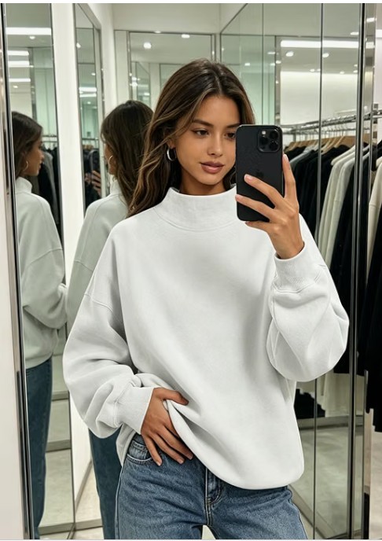 | 左侧中部 | 宽 31% × 高 79% | 486×688 |

---

## 第 7 页

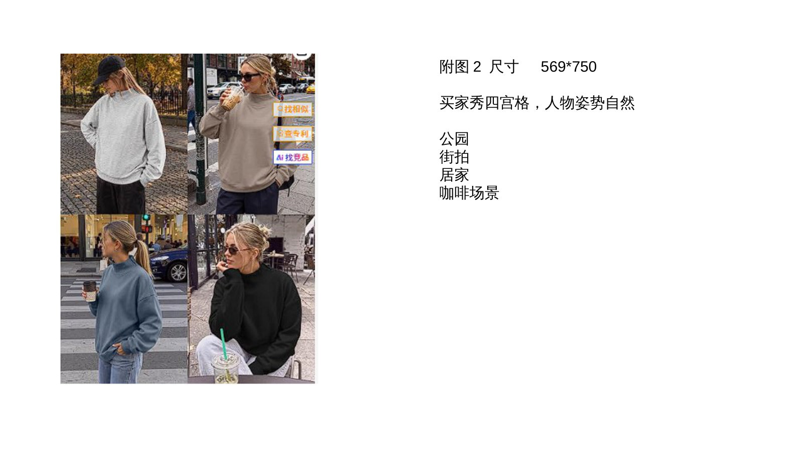

### 文字

附图2 尺寸    569*750

买家秀四宫格，人物姿势自然

公园
街拍
居家
咖啡场景

### 页内图片

| 图片 | 在页面的位置 | 占页面大小 | 原图尺寸 |
| --- | --- | --- | --- |
| 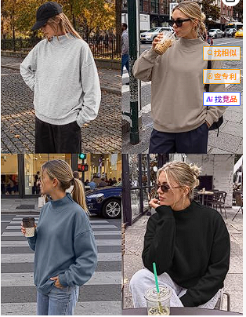 | 左侧中部 | 宽 32% × 高 73% | 314×404 |

---

## 第 8 页

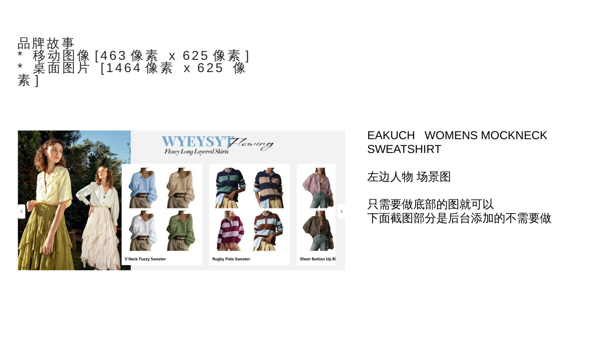

### 文字

**品牌故事* 移动图像[463像素 x 625像素]* 桌面图片 [1464像素 x 625 像素]**

EAKUCH   WOMENS MOCKNECK SWEATSHIRT

左边人物 场景图

只需要做底部的图就可以
下面截图部分是后台添加的不需要做

### 页内图片

| 图片 | 在页面的位置 | 占页面大小 | 原图尺寸 |
| --- | --- | --- | --- |
| 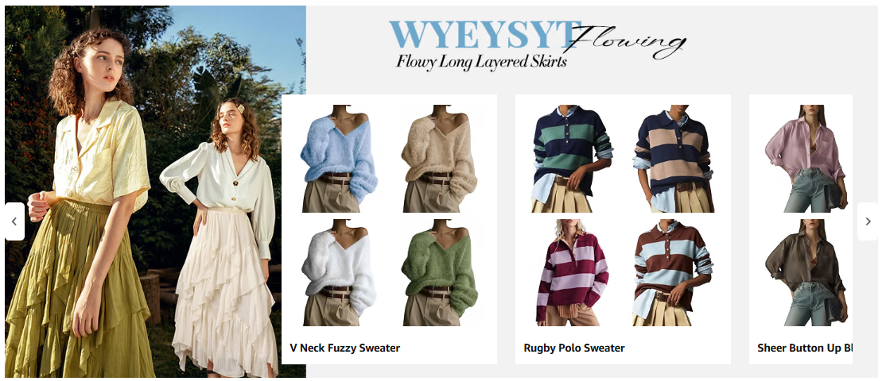 | 左侧中部 | 宽 54% × 高 41% | 1114×480 |

---

## 第 9 页

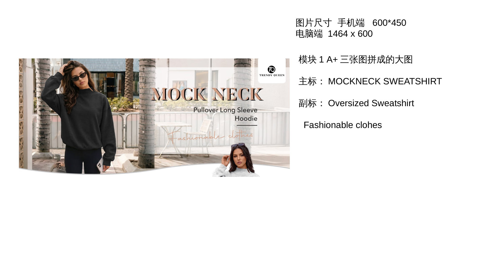

### 文字

图片尺寸  手机端  600*450
电脑端 1464 x 600

模块1 A+三张图拼成的大图

主标：MOCKNECK SWEATSHIRT

副标：Oversized Sweatshirt

  Fashionable clohes

### 页内图片

| 图片 | 在页面的位置 | 占页面大小 | 原图尺寸 |
| --- | --- | --- | --- |
| 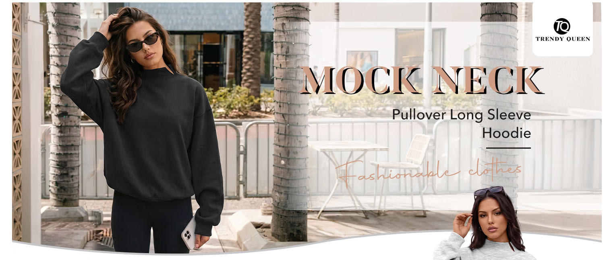 | 左侧中部 | 宽 57% × 高 44% | 1507×647 |

---

## 第 10 页

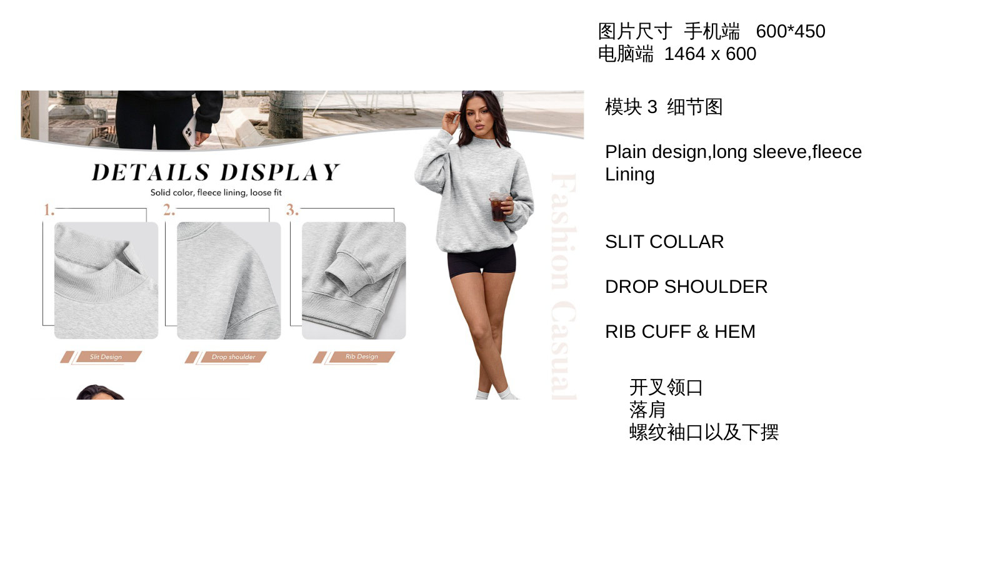

### 文字

图片尺寸  手机端  600*450
电脑端 1464 x 600

模块3 细节图

Plain design,long sleeve,fleece
Lining

SLIT COLLAR

DROP SHOULDER

RIB CUFF & HEM

开叉领口
落肩
螺纹袖口以及下摆

### 页内图片

| 图片 | 在页面的位置 | 占页面大小 | 原图尺寸 |
| --- | --- | --- | --- |
| 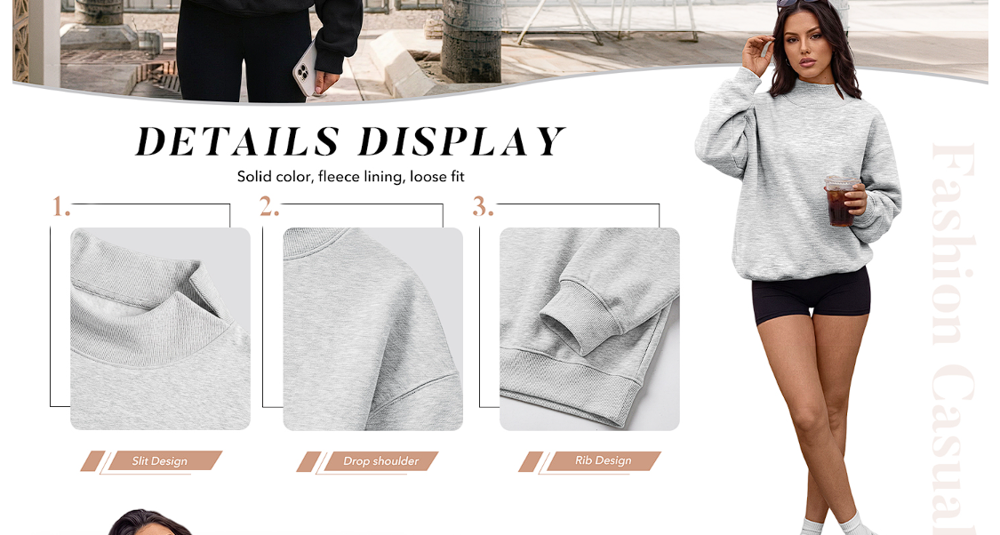 | 左侧中部 | 宽 58% × 高 55% | 1125×602 |

---

## 第 11 页

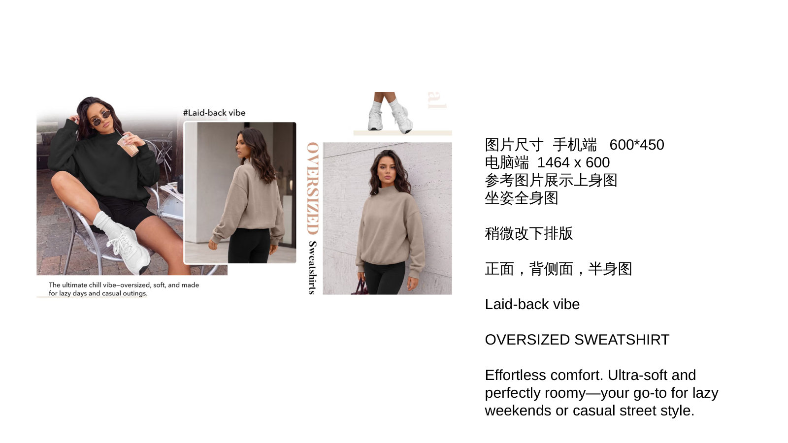

### 文字

图片尺寸  手机端  600*450
电脑端 1464 x 600
参考图片展示上身图
坐姿全身图

稍微改下排版

正面，背侧面，半身图

Laid-back vibe

OVERSIZED SWEATSHIRT

Effortless comfort. Ultra-soft and perfectly roomy—your go-to for lazy weekends or casual street style.

### 页内图片

| 图片 | 在页面的位置 | 占页面大小 | 原图尺寸 |
| --- | --- | --- | --- |
| 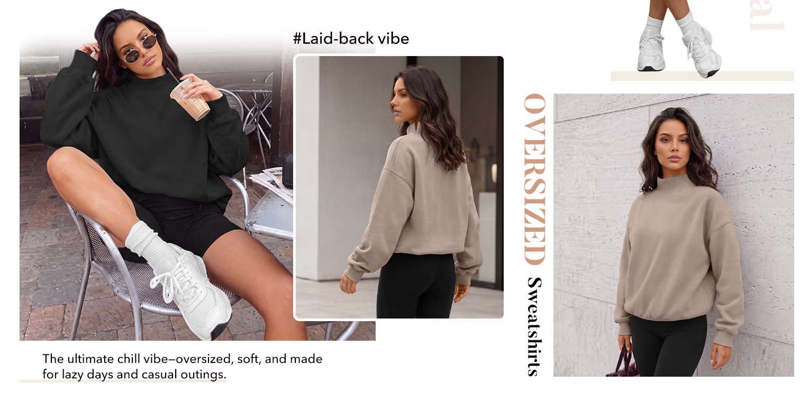 | 左侧中部 | 宽 54% × 高 48% | 1512×756 |

---

## 第 12 页

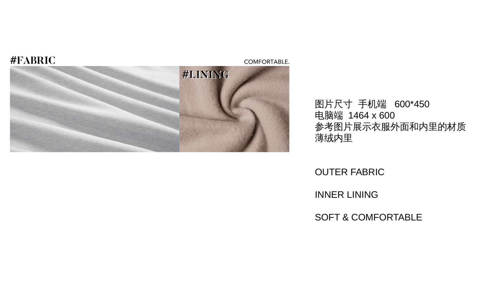

### 文字

图片尺寸  手机端  600*450
电脑端 1464 x 600
参考图片展示衣服外面和内里的材质
薄绒内里

OUTER FABRIC

INNER LINING

SOFT & COMFORTABLE

### 页内图片

| 图片 | 在页面的位置 | 占页面大小 | 原图尺寸 |
| --- | --- | --- | --- |
| 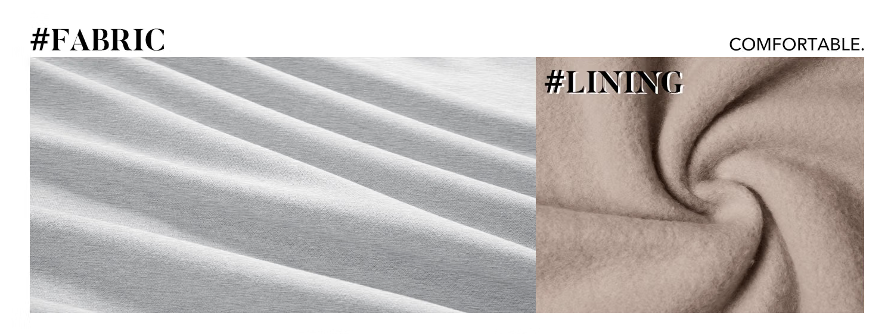 | 左侧中部 | 宽 59% × 高 40% | 1495×562 |

---

## 第 13 页

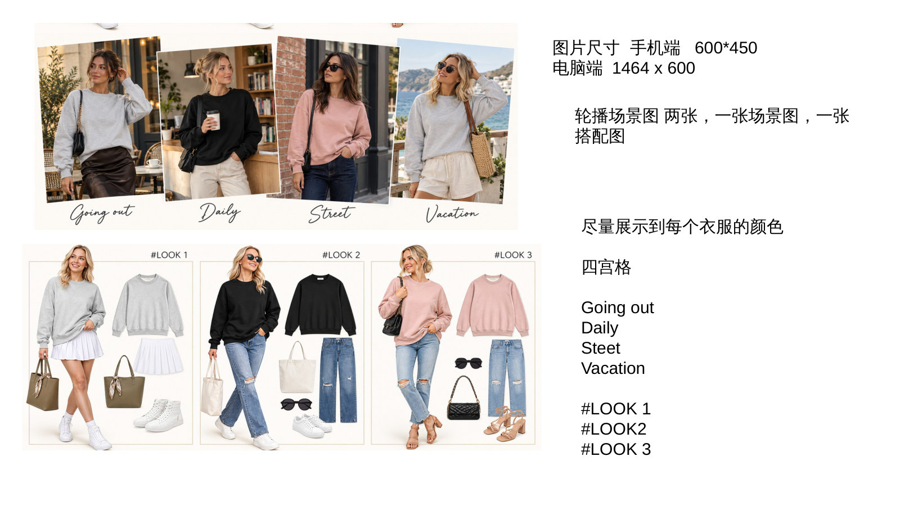

### 文字

图片尺寸  手机端  600*450
电脑端 1464 x 600

轮播场景图 两张，一张场景图，一张搭配图

尽量展示到每个衣服的颜色

四宫格

Going out
Daily
Steet
Vacation

#LOOK 1
#LOOK2
#LOOK 3

### 页内图片

| 图片 | 在页面的位置 | 占页面大小 | 原图尺寸 |
| --- | --- | --- | --- |
| 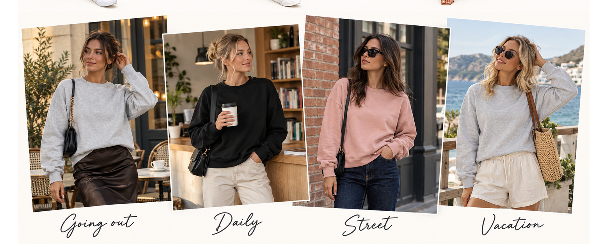 | 左侧上部 | 宽 56% × 高 41% | 1543×626 |
| 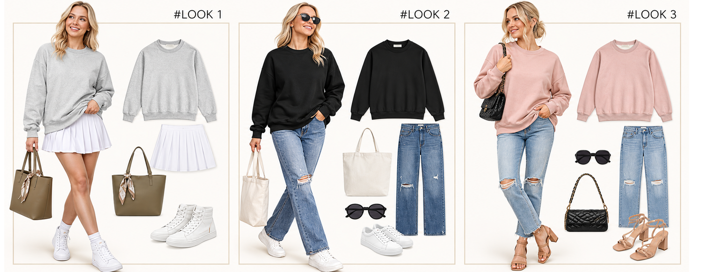 | 左侧下部 | 宽 59% × 高 41% | 1507×582 |

---

## 第 14 页

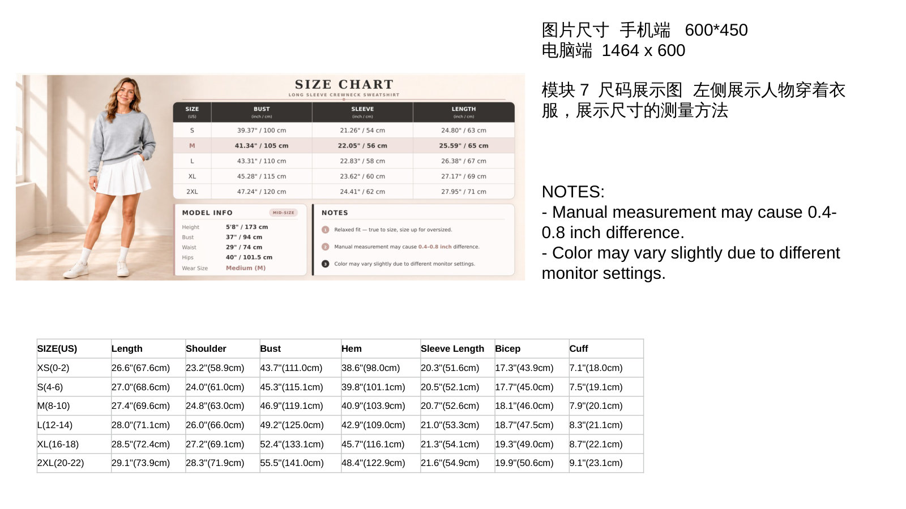

### 文字

图片尺寸  手机端  600*450
电脑端 1464 x 600

模块7 尺码展示图  左侧展示人物穿着衣服，展示尺寸的测量方法

NOTES:
- Manual measurement may cause 0.4-0.8 inch difference.
- Color may vary slightly due to different monitor settings.

### 表格

| SIZE(US) | Length | Shoulder | Bust | Hem | Sleeve Length | Bicep | Cuff |
| --- | --- | --- | --- | --- | --- | --- | --- |
| XS(0-2) | 26.6"(67.6cm) | 23.2"(58.9cm) | 43.7"(111.0cm) | 38.6"(98.0cm) | 20.3"(51.6cm) | 17.3"(43.9cm) | 7.1"(18.0cm) |
| S(4-6) | 27.0"(68.6cm) | 24.0"(61.0cm) | 45.3"(115.1cm) | 39.8"(101.1cm) | 20.5"(52.1cm) | 17.7"(45.0cm) | 7.5"(19.1cm) |
| M(8-10) | 27.4"(69.6cm) | 24.8"(63.0cm) | 46.9"(119.1cm) | 40.9"(103.9cm) | 20.7"(52.6cm) | 18.1"(46.0cm) | 7.9"(20.1cm) |
| L(12-14) | 28.0"(71.1cm) | 26.0"(66.0cm) | 49.2"(125.0cm) | 42.9"(109.0cm) | 21.0"(53.3cm) | 18.7"(47.5cm) | 8.3"(21.1cm) |
| XL(16-18) | 28.5"(72.4cm) | 27.2"(69.1cm) | 52.4"(133.1cm) | 45.7"(116.1cm) | 21.3"(54.1cm) | 19.3"(49.0cm) | 8.7"(22.1cm) |
| 2XL(20-22) | 29.1"(73.9cm) | 28.3"(71.9cm) | 55.5"(141.0cm) | 48.4"(122.9cm) | 21.6"(54.9cm) | 19.9"(50.6cm) | 9.1"(23.1cm) |

### 页内图片

| 图片 | 在页面的位置 | 占页面大小 | 原图尺寸 |
| --- | --- | --- | --- |
| 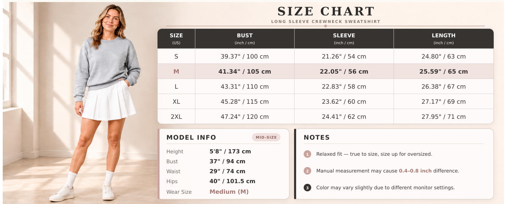 | 左侧上部 | 宽 57% × 高 41% | 1478×596 |
